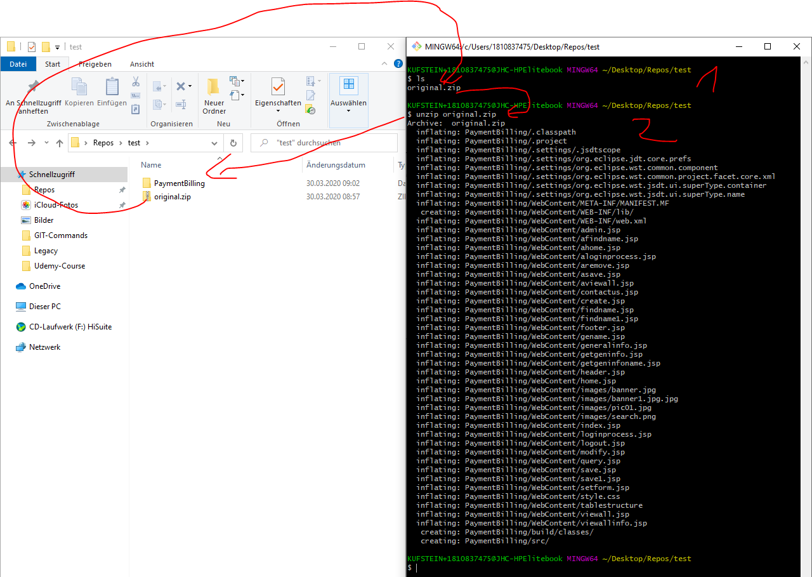

# Entpacken

Hier die Beschreibung wie man unterschiedlichgepackte Formate mit der Kommandozeile in Windows entpackt

## Zip-Datei

1. Navigiere in den Folder in dem die Zip-Datei liegt
2. Enpacke die Datei mit dem Befehl:
   > unzip "Dateiname.zip"

   > unzip orginal.zip

done