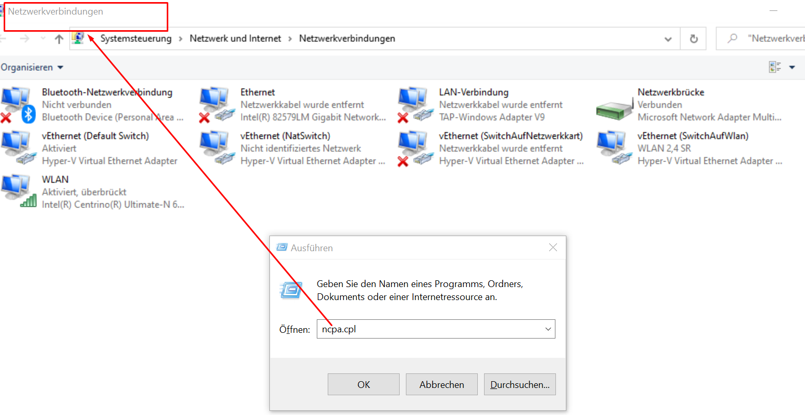

<h1>Netzwerkkonfiguration</h1>

## mit der Gui
1. öffne die Netzwerkkonfiguration
   > win+ r
   >ncpa.cpl
   

2. dann das ensprechende [NIC](./../Netzwerktechnik.wiki/G_Nic.md) auswählen & rechtklick 

hier werden dann die Einstellungen getroffen ob ein System die [IP-Konfiguration](./../Netzwerktechnik.wiki/G_IP-Konfigruation.md) via [DHCP]() oder [statischer Adresse]() erhält