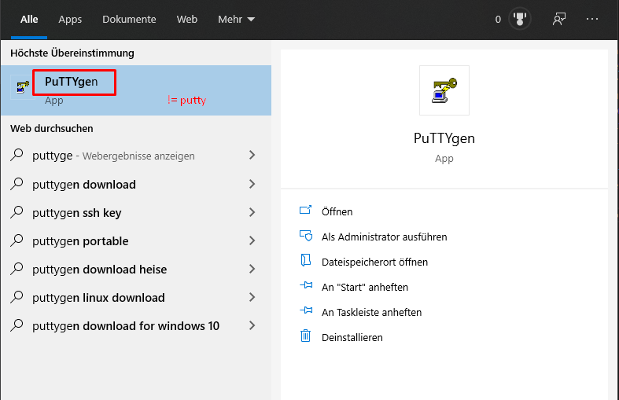
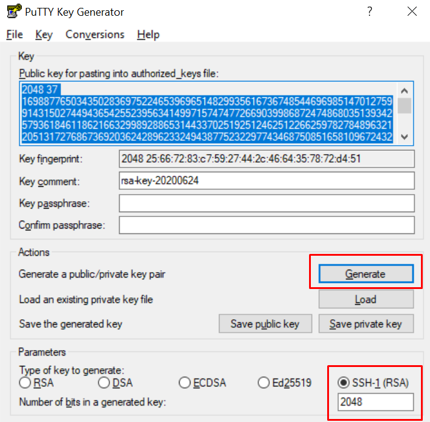
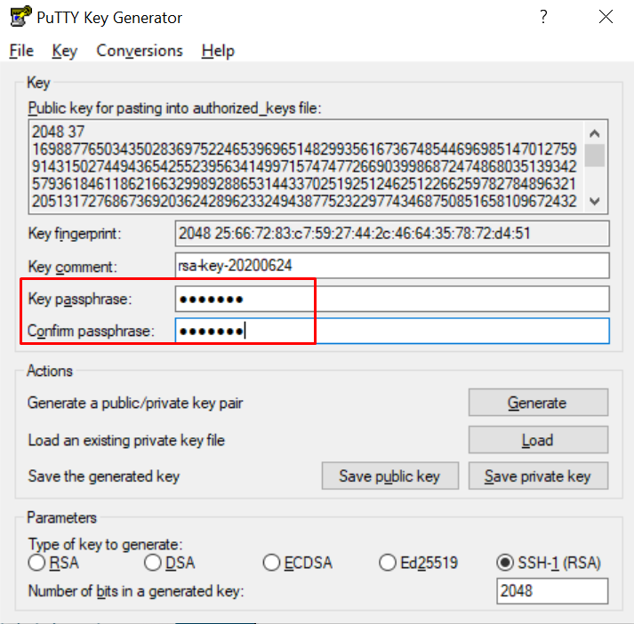
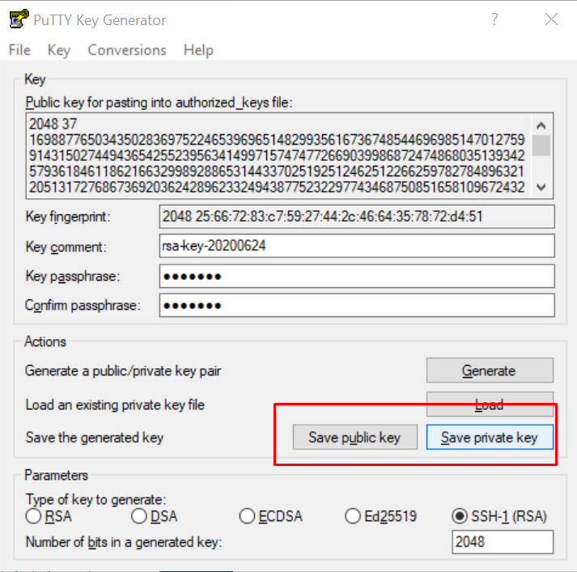

# Erstellen von SSH-Keys in Windows && unix

[Example](https://docs.joyent.com/public-cloud/getting-started/ssh-keys/generating-an-ssh-key-manually/manually-generating-your-ssh-key-in-windows)

[Download Putty](https://www.chiark.greenend.org.uk/~sgtatham/putty/latest.html), hier werden sowohl die Windows MSI files als auch die Unix [*.tar.gz]() hinterlegt.

1. Open the PuTTYgen program.

3. For Type of key to generate, select SSH-2 RSA.
4. Click the Generate button.
   
5. Move your mouse in the area below the progress bar. When the progress bar is full, PuTTYgen generates your key pair.
6. Type a passphrase in the Key passphrase field. Type the same passphrase in the Confirm passphrase field. You can use a key without a passphrase, but this is not recommended.

7. Click the Save private key button to save the private key. Warning! You must save the private key. You will need it to connect to your machine. Der normale Ablageort für private keys in Windows ist unter dem versteckten Folder:
   > \$User\$/.ssh

8. Right-click in the text field labeled Public key for pasting into OpenSSH authorized_keys file and choose Select All.

9.  Right-click again in the same text field and choose Copy.

Der Private Key muss im Client System hinterlegt sein, der Public-Key muss im RemoteSystem (=Server?) hinterlegt sein.

BSP für die Anwendung:

[Verwendung mehrerer Github Accounts]